# Cities Under Watch

Cities Under Watch was developed as a Django e-commerce platform for dystopian digital city posters, combining narrative worldbuilding, editorial design, and downloadable art sales.

---

## Project Overview

Cities Under Watch was developed as an original concept for a digital poster store centred on fictional and reimagined cities shaped by surveillance, authoritarian architecture, and quiet resistance. The platform allows users to browse themed collections, explore the context behind each print, purchase downloadable artwork, and access their digital orders through a personal account area.

The goal was to create an authentic digital art brand and e-commerce experience that felt publishable, immersive, and commercially viable.

---

## Project Background

Cities Under Watch was conceived as an original digital commerce concept for selling dystopian city poster artwork through a narrative-led, editorial storefront.

---

## Project Goals

### User Goals
- Browse dystopian city poster collections
- View detailed product information before purchase
- Purchase downloadable digital prints securely
- Access purchased downloads through an account area
- Understand the concept and world behind each collection

### Site Owner Goals
- Present a strong, original digital art brand
- Sell digital poster products through a believable e-commerce experience
- Organise products into themed city collections
- Encourage users to browse, purchase, and return for future collections
- Maintain a manageable admin workflow for products, collections, and orders

---

## Target Audience

The target audience for Cities Under Watch includes:
- people interested in dystopian visual culture
- fans of speculative fiction and graphic-novel-inspired artwork
- buyers of digital wall art and printable posters
- users drawn to themes of surveillance, architecture, power, and resistance
- creative individuals looking for statement artwork for home or studio spaces

---

## Project Identity

### Clearly Original Concept
Cities Under Watch was developed as an original digital poster e-commerce project built around a fictional narrative world. It uses a custom concept, custom content, custom visual identity, and custom page structure to create a distinct brand and shopping experience.

### Real Target Audience and Purpose
The site was designed for users who want to browse, purchase, and download digital poster artwork tied to a strong conceptual theme. It was structured as a believable commercial product with a clear e-commerce purpose.

### Consistent Theme
The project theme is carried across:
- branding
- typography
- colour palette
- page layouts
- product copy
- collection structure
- supporting context sections

### Real-Store Feel
The goal was for the site to feel like a genuine independent digital poster store rather than a student exercise.

---

## UX

The user experience of Cities Under Watch was designed to support two goals at the same time: create a believable digital art brand and provide a clear, trustworthy e-commerce journey. The site was designed to feel immersive and editorial without becoming difficult to use. Every major layout decision was made to balance atmosphere with clarity, so users could understand the world of the brand while still moving confidently through browsing, product selection, checkout, and account access.

### Strategy
The strategy behind Cities Under Watch was to create a digital poster store with a strong identity, a clear target audience, and a practical commercial purpose. The site was designed for users who are interested in dystopian visual culture, speculative fiction, architecture, and concept-driven artwork, while also serving as a realistic e-commerce experience for purchasing downloadable digital prints.

From a business perspective, the strategy was to present the project as a credible independent digital art brand rather than a generic online shop. From a user perspective, the strategy was to make the journey from discovery to purchase simple, intuitive, and visually cohesive.

**Strategy Evidence** 
The image below shows the core user goals and site owner goals that guided the planning and structure of Cities Under Watch.
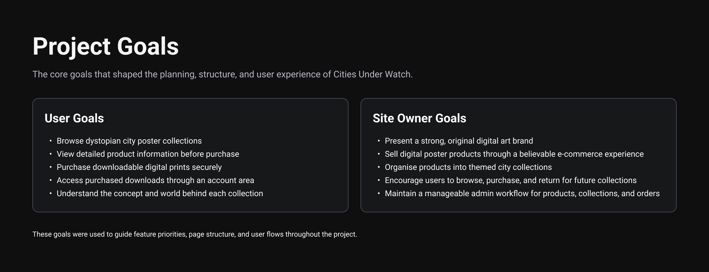

The image below summarises the target audience profile that shaped the planning and design of Cities Under Watch.
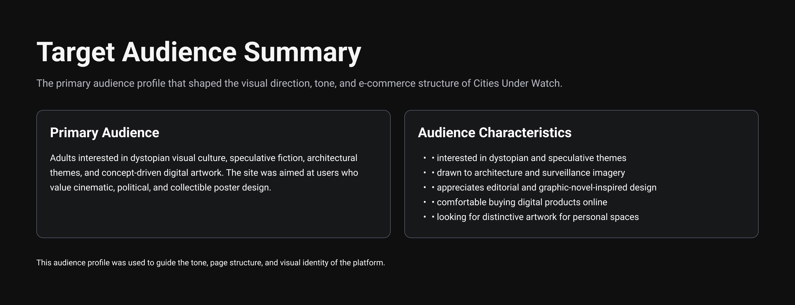

The diagram below shows the primary user flow that shaped the core structure of Cities Under Watch.
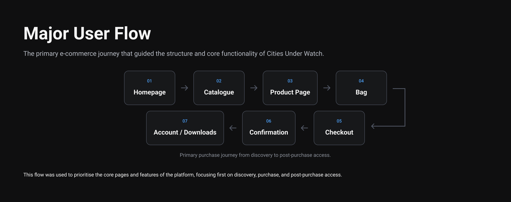

### Scope
The scope of the project was defined around the features needed to create a working digital download store.

The core scope included:
- a homepage that introduces the brand and product offer
- a catalogue page for browsing prints
- collection-based browsing by city
- individual product detail pages
- product option selection, including resolution
- shopping bag functionality
- secure checkout
- order confirmation 
- user registration and login
- profile area with order history
- access to purchased downloads
- admin management of products, collections, files, and orders

Additional supporting scope included:
- context/storytelling section to strengthen the narrative identity of the brand
- newsletter signup
- contact functionality
- related products and collection discovery

Features that were considered lower priority and kept outside the initial release included advanced personalisation, reviews, wishlists, and more complex recommendation systems.

**Scope Evidence** 
The images below show how features were prioritised using the MoSCoW method, how the project was broken down into epics and user stories, and how development was tracked through the GitHub project board workflow.

#### Feature Prioritisation
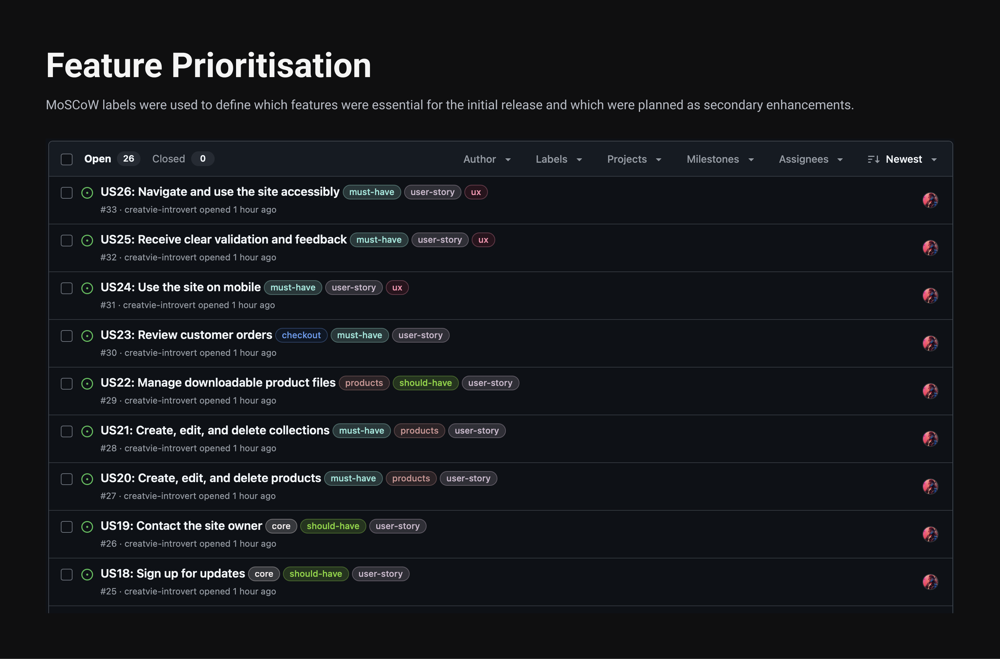

#### Epics and User Stories
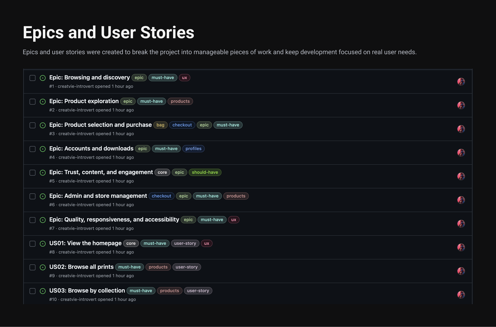

#### Project Board Workflow
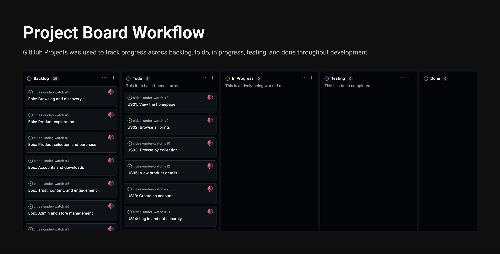

Project board: [Cities Under Watch Development Board](https://github.com/users/creatvie-introvert/projects/17/views/1)

### Structure
The structure of the site was built around the main user flows of a digital commerce experience.

The most important paths were:
- homepage to catalogue
- catalogue to product detail page
- product detail page to bag
- bag to checkout
- checkout to order confirmation
- login/profile to download access

To support this, the site structure was planned around a small number of clear page types:
- homepage
- catalogue page
- collection pages
- product detail pages
- profile/account pages
- checkout flow
- support/content pages

The structure was designed to keep the main user journey simple while also giving space for editorial context, collection storytelling, and supporting brand content.

**Structure Evidence** 
The visuals below show the site map, page hierarchy, and navigation structure used to define the architecture of Cities Under Watch.

#### Site Map
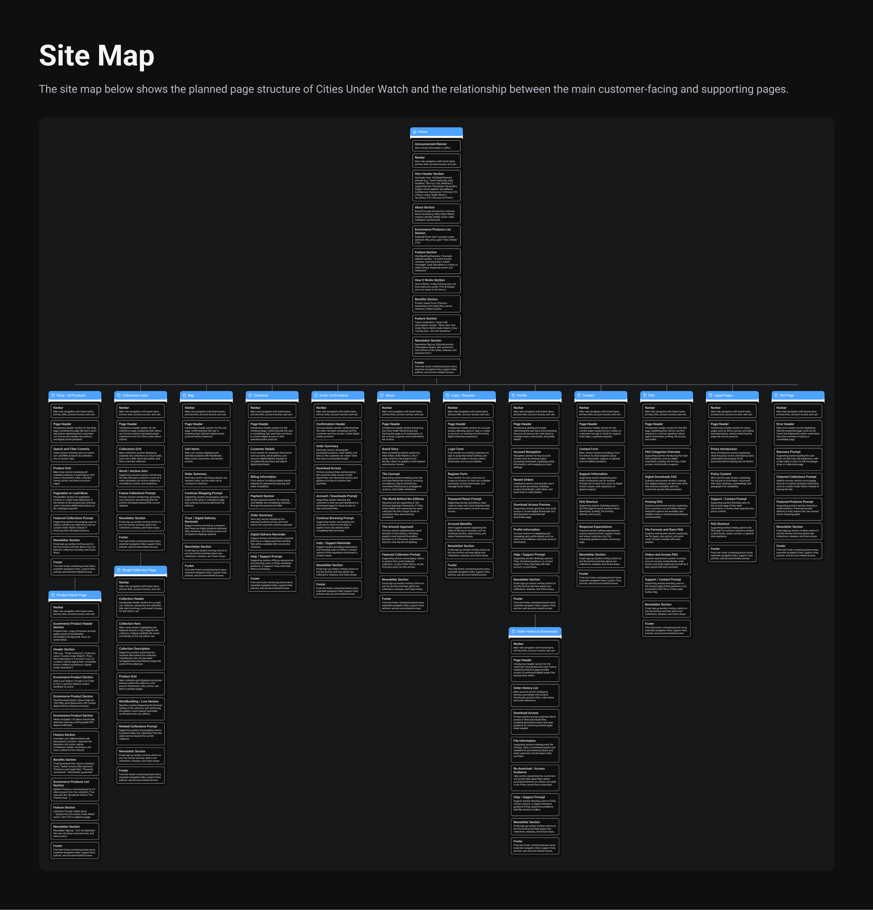

#### Page Hierarchy
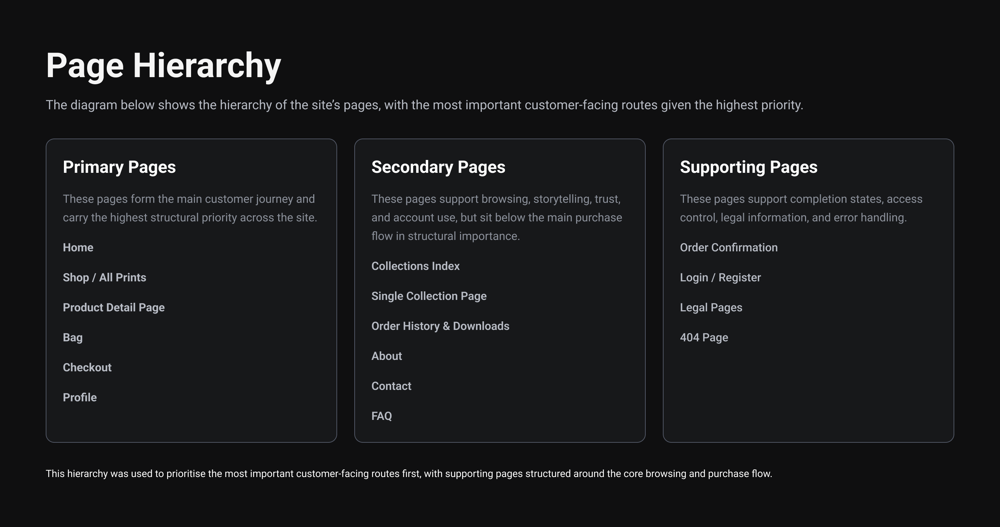

#### Navigation Structure
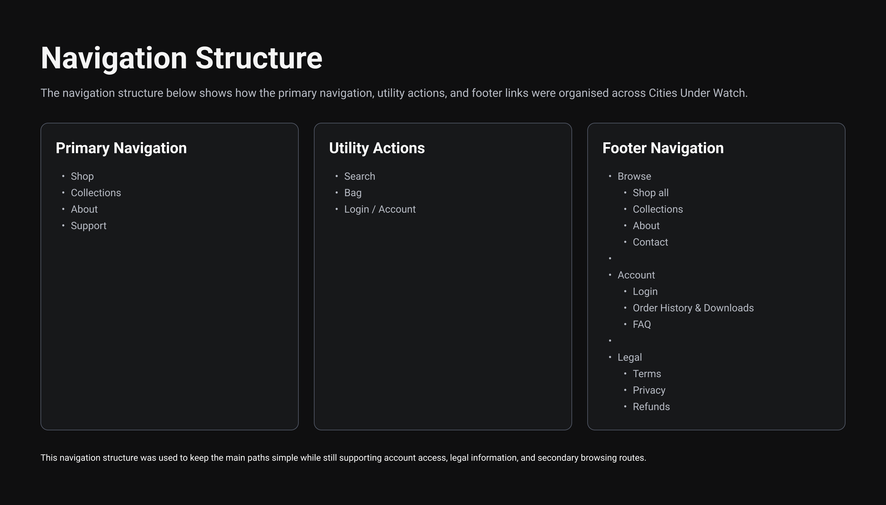

### Skeleton
The skeleton stage focused on arranging information clearly before visual styling was applied. Low fidelity wireframes were used to establish content hierarchy, layout patterns, and user flow.

At this stage, the priority was to define:
- where key navigation and calls to action should appear
- how products would be displayed in grids and collections
- how product detail pages would guide the user toward purchase
- how supporting sections would provide context without overwhelming the commerce flow
- how users would move into profile and download areas after purchase

This helped ensure that the layouts were solving real user needs before high-fidelity design work began.

**Skeleton Evidence** 
The visuals below show the low-fidelity wirefranes and the key layout decisions that shaped the structure of Cities Under Watch before visual styling was applied.

#### Low-Fidelity Homepage Wireframe

#### Low-Fidelity Product Page Wireframe

#### Key Layout Decisions
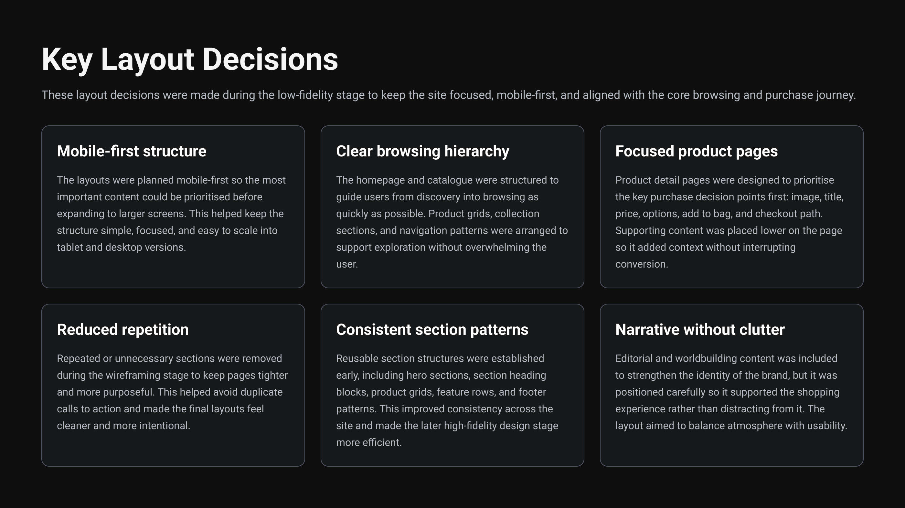

### Surface
The surface plane was used to define the final visual identity of the site. The interface was designed around a dark, editorial aesthetic that reflects the dystopian themes of the project.

The visual language of the site was shaped by:
- a dark background palette
- restrained but deliberate accent colour use
- strong typography hierarchy
- clean spacing and minimal visual clutter
- simple, structured card and section layouts
- image placeholders and composition choices designed to support cinematic poster artwork

The final result was intended to feel premium, atmospheric, and controlled, while still being clear and usable as an e-commerce experience.

**Surface Evidence** 
The visuals below show the high-fidelity designs used to define the final visual dirtection of Cities Under Watch across the most important customer-facing pages.

#### High-Fidelity Homepage Design

#### High-Fidelity Catalogue Page Design
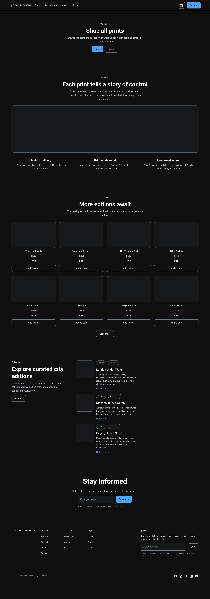

#### High-Fidelity Product Detail Page Design
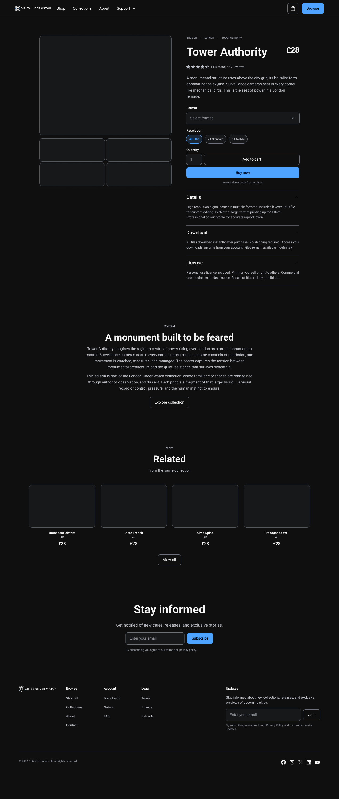

### Design Choices
The design choices for Cities Under Watch were made to support the brand concept and maintain consistency across the site.

#### Colour
A dark colour palette was chosen to reinforce the site's themes of surveillance, control, and dystopian urban environments. Lighter text colours were used to maintain readability, while a restrained blue accent was used to highlight key actions and selected states.

**Colour Evidence**
The visuals below show the core palette, reusable colour variables, and contrast testing used to support the visual identity and readability of Cities Under Watch.

#### Colour Palette
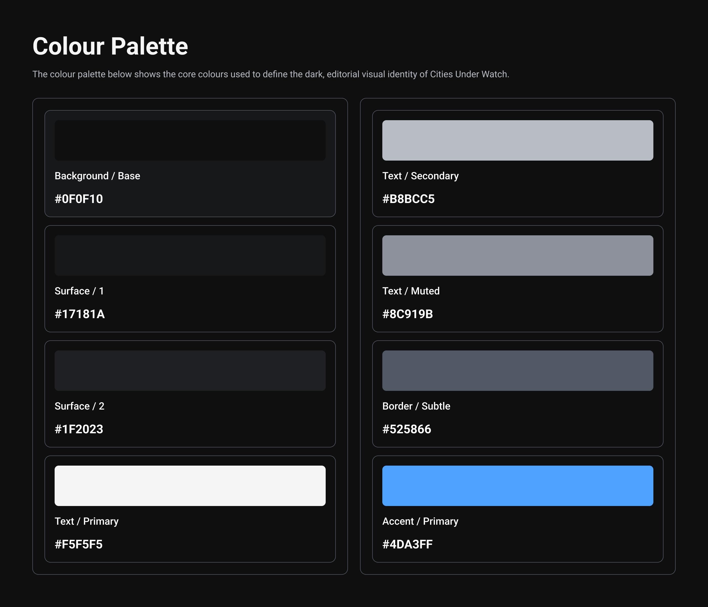

#### Colour Variables
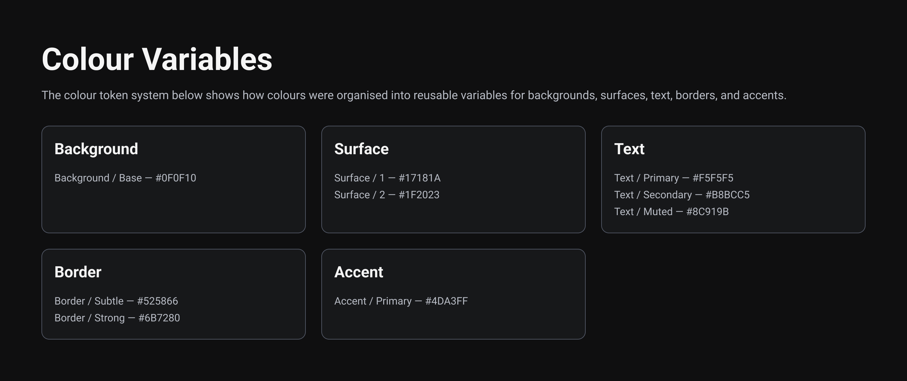

#### Colour Contrast Testing
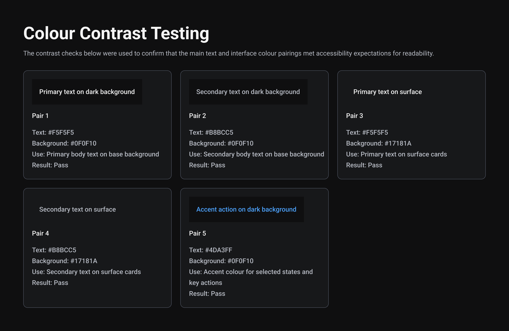

#### Typography
Roboto was chosen as the main typeface because it provides clarity, flexibility, and a modern feel while still fitting the editorial tone of the project. Clear heading, body, and label styles were established to maintain hierarchy across all pages.

**Typography Evidence** 
The visuals below show the typography system, heading and body style reference, and type scale decisions used to create hierarchy and readability across Cities Under Watch.

#### Typography System
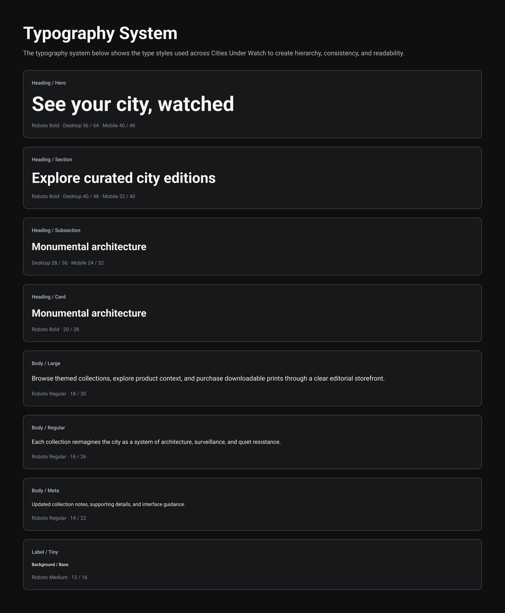

#### Heading and Body Style Reference
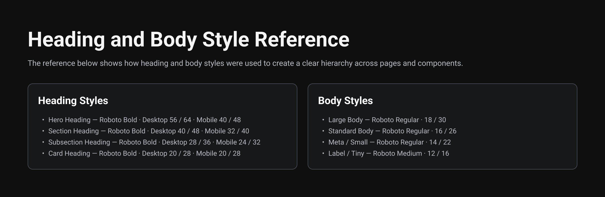

#### Type Scale Decisions
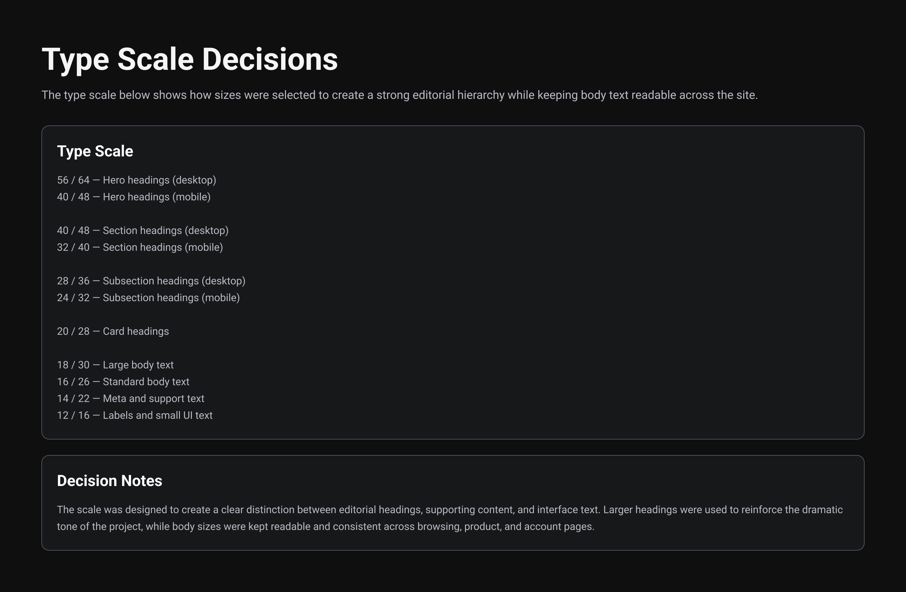

#### Layout
Layouts were built mobile-first and scaled up into desktop variations. Repeated spacing, section structures, and component patterns were used to create consistency and make development more efficient.

**Layout Evidence**
- _Placeholder: spacing system image_
- _Placeholder: grid/layout rules_
- _Placeholder: responsive layout examples_

#### Components
Buttons, inputs, tags, checkboxes, radios, section headings, product cards, and feature cards were all standardised through a shared design system. This reduced inconsistency and helped keep both the design and future development process clean.

**Component Evidence**
- _Placeholder: high-fidelity components page_
- _Placeholder: button system_
- _Placeholder: form/input components_
- _Placeholder: card/component patterns_

### Wireframes
The low-fidelity stage made it easier to remove repeated or unnecessary sections, simplify navigation decisions, and focus the site around the strongest user flows.

**Wireframe Evidence**
- _Placeholder: low-fidelity homepage wireframe_
- _Placeholder: low-fidelity catalogue wireframe_
- _Placeholder: low-fidelity product detail wireframe_

### High-Fidelity Designs
High-fidelity designs were created after the main structure had been validated. The high-fidelity stage focused on applying the established visual system, typography, colour palette, spacing rules, and reusable components across the key pages of the site.

The most important customer-facing pages were designed in high fidelity first, including the homepage, catalogue page, and product detail page. Once those patterns were established, the rest of the site could follow the same system without needing every page to be redesigned from scratch.

**High-Fidelity Evidence**
- _Placeholder: high-fidelity homepage design_
- _Placeholder: high-fidelity catalogue page design_
- _Placeholder: high-fidelity product detail page design_
- _Placeholder: additional responsive high-fidelity screens_

---

## Agile Planning

The development of Cities Under Watch is guided by an agile planning approach. Before development began, the project was broken down into clear epics, user stories, major user flows, and a defined app structure. This early planning stage was used to ensure the application would have a clear purpose, a logical build order, and a strong, original identity.

### Epics
The project is organised around the following major epics:
- Browsing and discovery
- Product exploration
- Product selection and purchase
- Accounts and downloads
- Trust, content, and engagement
- Admin and store management
- Quality, responsiveness, and accessibility

### User Stories
User stories were created to define the key needs, goals, and actions of different users interacting with Cities Under Watch. They were used to shape the structure of the site, prioritise core functionality, and ensure that development stayed focused on real user needs rather than unnecessary features.

The stories cover the main user journeys across the platform, including browsing the catalogue, exploring collections, viewing product details, adding products to the bag, completing checkout, accessing downloads, and managing products and orders from an admin perspective.

#### Browsing and discovery

US01
As a visitor, I want to land on a clear homepage, so that I can quickly understand what Cities Under Watch is and what it sells.

US02
As a shopper, I want to browse all available prints in one catalogue, so that I can explore the full product range.

US03
As a shopper, I want to browse prints by collection or city, so I can explore products by theme and narrative world.

US04
As a shopper, I want to search or filter prints, so that I can find products more quickly.

#### Product exploration

US05
As a shopper, I want to open a product detail page, so that I can understand exactly what I am buying.

US06
As a shopper, I want to read the story and context behind a print, so that I can decide whether it fits my interests and taste.

US07
As a shopper, I want to view related prints from the same collection, so that I can discover more artwork I may want to buy.

#### Product selection and purchase
US08
As a shopper, I want to choose the product resolution or file option, so that I can purchase the version I want.

US09
As a shopper, I want to add a print to my bag, so that I can review it before paying.

US10
As a shopper, I want to view and manage the items in my bag, so that I can confirm my order before paying.

US11
As a shopper, I want to complete checkout securely, so that I can purchase my digital products with confidence.

US12
As a shopper, I want to see an order confirmation after payment, so that I know my purchase was successful.

#### Accounts and downloads

US13
As a customer, I want to create an account, so that I can access my orders and downloads later.

US14
As a customer, I want to log in and out securely, so that I can access my personal account safely.

US15
As a logged-in customer, I want to view my profile and order history, so that I can review my past purchases.

US16
As a logged-in customer, I want to access my purchased downloads, so that I can download my files again whenever needed.

#### Trust, engagement, and support

US17
As a visitor, I want to read about the concept behind the brand, so that I can better understand the identity and purpose of the site.

US18
As a visitor, I want to sign up for updates, so that I can hear about new city collections and future releases.

US19
As a visitor, I want to contact the site owner, so that I can ask questions or request support.

#### Admin and management

US20
As a site admin, I want to create, edit, and delete products so that I can keep the catalogue accurate and up to date.

US21
As a site admin, I want to create, edit, and delete collections, so that I can organise prints into meaningful groups.

US22
As a site admin, I want to manage downloadable product files, so that customers receive the correct assets after purchase.

US23
As a site admin, I want to review customer orders, so that I can monitor sales and resolve issues if needed.

#### Quality and usability

US24
As a mobile user, I want the site to work well on my phone, so that I can browse and purchase easily on a small screen.

US25
As a user, I want to receive clear feedback when I complete an action or make an error, so that I always understand what is happening on the site.

US26
As a user with accessibility needs, I want the site to be clear and usable, so that I can navigate and interact with it without unnecessary barriers.

### MoSCoW Prioritisation
The project uses MoSCoW prioritisation to organise features by importance:

#### Must Have
- homepage
- product catalogue
- product detail pages
- shopping bag
- checkout
- user authentication
- order confirmation
- profile area
- download access
- admin product and order management

#### Should Have
- collection pages
- related products
- context/story sections
- newsletter signup
- contact functionality

#### Could Have
- enhanced filtering
- more advanced recommendation logic
- expanded collection storytelling
- richer account features

#### Won't Have (for initial release)
- complex social features
- reviews system
- wishlists
- advanced personalisation

### Project Board / Workflow
The project workflow was based on building the most important user journeys first. The first priority is the core e-commerce flow:
homepage ➔ catalogue ➔ product page ➔ bag ➔ checkout ➔ order confirmation ➔ account/download access.

Supporting content, collection storytelling, and secondary features were added around this core flow once the main product and purchase journey was stable.

---

## Features

### Existing Features
_To be completed_

### Features Left to Implement
_To be completed_

---

## Data Model

The database structure for Cities Under Watch was planned before development using an entity relationship diagram created in dbdiagram. The aim of the data model is to support a digital e-commerce workflow while also reflecting the site's collection-based structure and narrative worldbuilding.

### Database Design
The project uses a relational database structure to connect users, profiles, cities, collections, products, product images, downloadable files, orders, and order line items. This supports both the e-commerce functionality of the site and the collection-based structure of the catalogue.

### Entity Relationship Diagram
The entity relationship diagram below shows the planned database structure for Cities Under Watch and illustrates how the main models connect across users, profiles, products, collections, downloadable files, and orders.

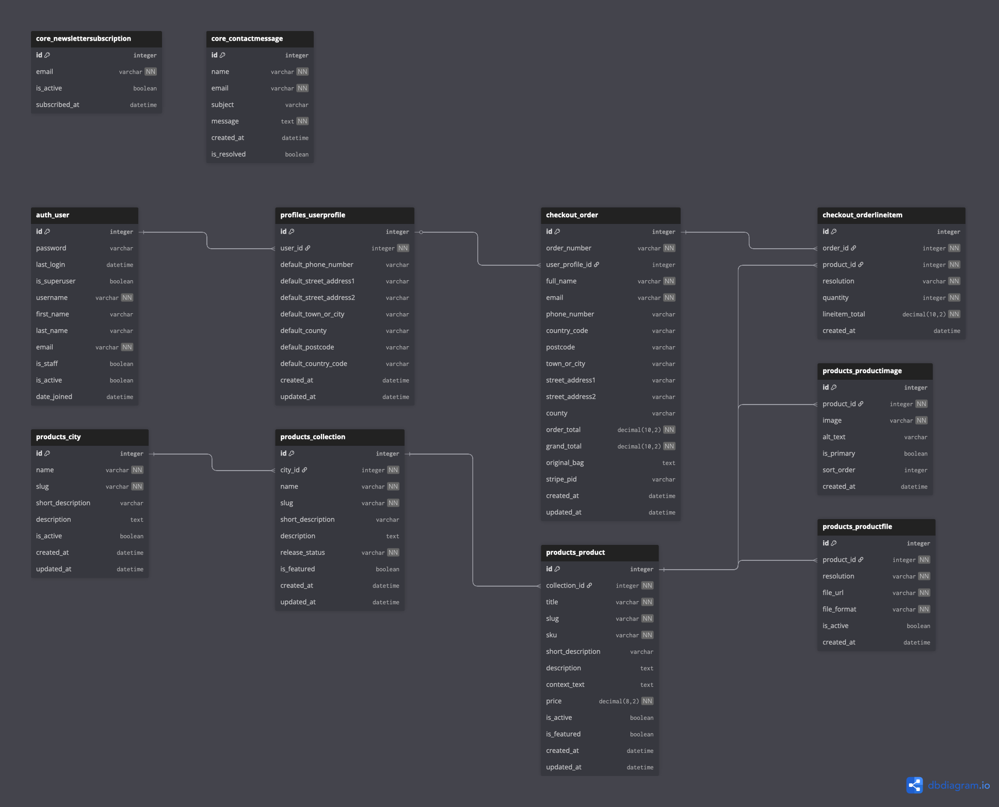

---

## Technologies Used

### Languages
- HTML
- CSS
- JavaScript
- Python

### Frameworks, Libraries and Tools
- Django

### Database
- PostgreSQL

### Design and Planning Tools
- Figma
- dbdiagram

### Development Tools
- VS Code
- Git 
- GitHub

### Deployment and Hosting
- Heroku

### Python Packages and Libraries
- Django Allauth
- Gunicorn
- Psycopg2
- Pillow
- django-countries
- Stripe

### Front-End and UI
- Google Fonts
- Font Awesome

### AI Prompting and Visual Asset Creation
- ChatGPT
- Sora  

---

## Django Apps

The app structure was chosen to keep the codebase organised and to ensure that each part of the application has a clear and meaningful purpose.

### Planned App Structure

#### `core`
The `core` app was planned to handle site-wide content and general pages such as the homepage, about page, contact page, FAQ, newsletter signup, and legal pages.

#### `products`
The `products` app was planned to handle the product catalogue, city collections, product detail pages, related products, and search or filter functionality.

#### `bag`
The `bag` app was planned to handle the shopping bag logic, including adding products, updating quantities, and removing items before checkout.

#### `checkout`
The `checkout` app was planned to handle the checkout flow, payment processing, order creation, order line items, and order confirmation.

#### `profiles`
The `profiles` app was planned to handle the authenticated user account area, including saved profile details, order history, and access to purchased downloads.

---

## Authentication and Authorisation

Authentication in Cities Under Watch exists for a clear user purpose.

Registered users will be able to:
- create an account
- log in securely
- view their order history
- access purchased downloads
- manage profile details

Authorisation will also be used to protect admin-only functionality. Product management, collection management, and order management features will only be available to authorised admin users, while standard users will only be able to access their own account and purchase history.

This structure supports both a better customer experience and a clear separation between store management and normal user activity.

---

## E-Commerce Functionality

Cities Under Watch is designed as a digital product e-commerce platform for downloadable poster artwork.

The intended purchase flow is:

1. browse products through the catalogue or collection pages
2. open an individual product detail page
3. select the appropriate options, such as resolution and quantity
4. add the product to the shopping bag
5. review the bag and proceed to checkout
6. complete payment securely
7. receive order confirmation
8. access purchased files through the account area

The e-commerce functionality is designed specifically for digital downloads rather than physical products, which means the post-purchase experience is especially important. Users should be able to access their orders and downloads clearly and reliably after checkout.

---

## Testing

### Validation
_To be completed_

### Manual Testing
_To be completed_

### Automated Testing
_To be completed_

### Bugs Fixed
_To be completed_

### Known Issues
_To be completed_

---

## Deployment

### Local Development
_To be completed_

### Heroku Deployment
_To be completed_

### Environment Variables
_To be completed_

---

## Version Control

This project is version controlled using Git and GitHub.

Development will follow a clean and regular commit history using meaningful commit messages.

---

## Credits

### Code
_To be completed_

### Content
_To be completed_

### Media
_To be completed_

### Acknowledgements
_To be completed_